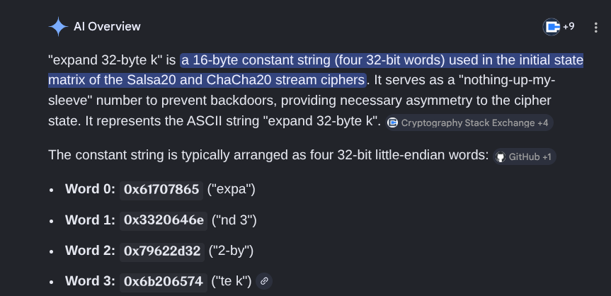

**Challenge Name :** obfer

### **Category :** Reverse Engineering

### **Description :**

> a bit obfuscated
> 
> 𝐀𝐮𝐭𝐡𝐨𝐫 : **𝐁𝐥𝐚𝐜𝐤𝐤𝐚𝐝𝐞𝐫**

### **Files Given :** _'obfer / encrypted.txt'_

---

## Solution


Hmm , a bit obfuscated binary i guess ,  lets go :


```bash
❯ file obfer
obfer: ELF 64-bit LSB executable, x86-64, version 1 (SYSV), statically linked, for GNU/Linux 4.4.0, stripped

DH/writeups/obfer 
❯ ./obfer
heyy 󠀁󠁃󠁈󠁁󠁌󠁌󠁅󠁎󠁇󠁅󠀠󠁏󠁗󠁎󠁅󠁒󠀠󠀯󠀠󠁁󠁕󠁔󠁈!
flag 󠀁󠁃󠁈󠁁󠁌󠁌󠁅󠁎󠁇󠁅󠀠󠁏󠁗󠁎󠁅󠁒󠀠󠀯󠀠󠁁󠁕󠁔󠁈?? Securinets{testtest}
here it is: a73779adeaadf33651b116fec19555380ffcd37b1b3cbfaf9a736eaef8a14c4a0fa44379fa71f3e162ceaf6909fbe5526302abe17980d5b52d6a0c8f89ee6b890fb98586f2755709f7a93f3d52fde19b132003aa9a1a5938b88c82a9dddd9572a1b8c0d1d37f966deb72e8fde874f5a9f37238e0e0e518188547ab8b4f324036a6dfb3099b4ca8290220b863003c916e35e263f00facc8d63ebcc6e876e66ecc4fe12d43bae967591bbee7631f6b68b847ea15d11f73c5ee135317ed25e109c217bb461f48001eb3e37d6f0f3a3810b2b3e75f5ccc320166effbed068c5e4fdf2aede7b6f9c9a9ebcad78db28d0db5ee6ece8635de34b3a725568894ee4b8d2aea6f5b927e96e3cb89f58274c362f2216624741f61b0e00c0632e415cfdb9580077dbb7380e7754f9efc4fdc4912cc9e397a1e5bd88d54e2cdd0861a56b00cbe4846b7c3196eb3c27b11fdbe4d17f612cdb899549992a8f9f0c5ccf8adbb3bf574d08a0a01eb2812ade4d67f7e141024761aebc2eba02ef407e8b0d88f4cdef7c14ec7647a73444e5531559a12d575910895aca473de0f642346373021086419e0db4168684387b64bd1a6e43d9a6276a4c945021848b741ffdf7cff5b540b0820ba80efe51552855dd772385efdf6f2de27331b650de709b3a81a965ca07da2f87357f624cdee59c78757da7337fe866cb48db0bdc3eafe657090794d14ca82e624635585ced5ed4c524e94b412d2321b2a4e37f2c55a5cea4db2f1d51315fa5254c7ee2da1c9565544bddcde525aba4f2b33947dacdd87fba4a5e1bfa2f2869f297dd71f2ee962c56afca0a881128e4b4468a55839ba343547ff8fd4b41c3f514e379177226073ecc7a7ee71af1668048a5f273d6acfa0698a0be78f0cc27e7853884f0c4b81158e0a07b912151dcea9daad19d6621bf17597dd3f906b1450daabf6184839d8f00320e7516735a349cb54e9eb3bd18b2a559d0bb0899e76ea56a87f48b8d9afd773c5359f4b321011e00c15e080f47a6f8017b2ab042d8fd8133f356da974d4ce99d49381e95c29323e660f828fbe598ffdb936604737c3b9b75f7bd879b37fdebfbe609aa3985d1a0c2af91b88c2524e43d47702d6938d71b26a3cc7f2573c3ca22b64a9bb02c8f5442509cf7787cb3b164d8a1984c8c841766be9b54b829d8178bad69ebb0d396aaf37520669886e7aeeda6a61e26dd9200f72606f96b5f908a9bb7619733ca3904f22de22be5ebe4dddb826738d5c9a56f184b8a7c428a063904c2be12b4c5e1d0685aa4a8a1cb8e01839f4366f2b04252a725fd84ad9d6a7c4d033fb51025e2f7c21cbc9f5a0e36b1b0520ce94662a7c9fd6baf598f4869ba1ab922dabe53008ad509ee290fcc45c11b02508eb259cf6b7fd6ef5bb5c1137389a6a72cea668161c84a7bbad6c65c1e3dc95c5588fc8cbc4d1bf280758f7031ec90a067324bf5d5787ff998899798b9b22485f422c8cc29e10f30106be6699e12ac899318c867fb69422b9b622355c434a138e78e19d9cf089162d0997e55b9cb1b1fd8c9f9af1d1639059dd2e712733d549f828a53474e9264528db69a5a388eda781047badeede5897b125bc047517eb9c3c5534c8a4f3e065f17e59659a9e4dc1b6f2f2abd924f84d48e023286f6369385949665efe0bc82e529495820ca689c5eedc4e73b69b3b28fe85c42bfca3cd58fc22c0dc45bb5056c884ce972bae4cbcac6da6cd8641e2a0537f26820401dbe07a28bc87f582cccd990717ec7d17b27bba426f63fec077f762e2d32896b6934fea98991c36a4bfdb6b845bca8f6b30752b2f75344370f6a1fb664de531c864b04631ba60c97fb741221270ab03fbe56625ac82ea797744275bf81cc1fb2e30c84dc33209e14def7f66e4ecafc83f2d2725804cda8d5af3baf45e955dc1910df0a1d7d94f4219b810ccce3cf44005e27045b84c7ca6f187a4494539c793204e3c0eb2d6554a783a65005efe1cc7fc604e0b1ff692f23d1332f560e8bb27a0ca22e87df2d43c46cc50c7ef3d65a586285ec68db1302d2140cd0245bbae0d6204743f48230b81ccb3a9a90629000ae35b281e4513fe036563e24535c71b1b55dae84586ff303e38b3546a785bb045d7898c7ca3619b5aec111a35c8d19203bace906f50c69ae08e9ef0e0df600a2c3c92b9db22ce449df4fce285e712db03b40efa969eddcb7e343e4b64358791040418bc7fa695deee82a58ca8862ba549f357cef85bfbe1f6112d18fdeb882f6bc3a9240f4c2ea7b3ad6ab2a7c2ef42ae242b655a619ba3b6afe67f039dd7093383e273002b9706c893cd797d1152ed84290f27a66e50d9fee886b550f2afedc537c1fc59906e92f0e0f68c01db5e3e139eb31dd7180e62f5b884c650b6a61a757990c1266c744062a25ecf0688f23a4964a0985d48de32a36b82fd8e75fe16b44e9e4bb542dcdb1cfd13d8f9a85137f9d2db4f7031a86562e1225ab72d5f8487309262f52283cc2b62c18f902a36d523bd7bb726e49d73ab1f9d395b11a0508ba72a61168bc4d16392631ac5c7c1f1493e6d519de3a9e969bbd64b83a2a8f900ac898aaa67be1b41c994f9f80a5e96fa9d7e2ea61fcb8b84c6d02347a8c69b948db86a82b150d3902ecf847bcf0a43c93ccbc341628cd9065fe90c50dd58709dd77da7c877cd157dd426daa9597b929f53dbf005ea42bab9110a98a0d6ab96e14987ac9b05e1bb8f24957324141e6bfd5c535077a847ff83da1cdc1deb3da54fd56e9a2ccfb01eb1008d6ca3991764b3a131d26dc08233fb60bf14b7d894ac617cc3390974c9af476d4a7fe30080b3bd57eaf709165f3ea12a34308ab2447fdfa2328e27d1f66fab47eb0deaa7207ec446f3d0789ea4cba1f78803911460294580fcae72ab217b5b
KILLED !
```
Well , a simple crackme , we need the original input which is our flag , copying and pasting the output to the certain AIs will result on them refusing your request , cause the author used **Hidden Unicode characters** to inject a prompt in the strings , using [Ascii Smuggler](https://embracethered.com/blog/ascii-smuggler.html) ( it might be patched by the time you read the writeup) , so dont paste the strings blindly , we will also confirm this using ida, time for our ida :
```C
int __fastcall main(int argc, const char **argv, const char **envp)
{
  __int64 v5; // rax
  _QWORD *v6; // rax
  REDACTED.....
  char v116; // [rsp+58Fh] [rbp-21h]

  if ( (unsigned int)sub_6A17BD(unk: argc, unk: argv, unk: envp) )
    sub_3620DE();
  v5 = sub_738EE0(unk: &unk_8DB620, unk: &unk_201078);
  sub_737330(unk: v5, unk: sub_738790);
  sub_36348A(unk: v74);
  sub_738EE0(unk: &unk_8DB620, unk: &unk_2060A0);
  v6 = (_QWORD *)sub_74F3E0(unk: &unk_8DB860, unk: v74);
  v7 = (char *)v6 + *(_QWORD *)(*v6 - 24LL);
  if ( !(unsigned __int8)sub_70AF20(unk: v7) )
  {
    if ( (unsigned int)sub_6A17BD(unk: v7, unk: v74, unk: v8) )
      sub_3620DE();
    sub_36119C(unk: v73, unk: v74);
    sub_3612EA(unk: v75, unk: v73);
    sub_363FF6(unk: v73, unk: v75);
    sub_3634FA(unk: v75);
    sub_36348A(unk: v72);
    sub_364282(unk: v56, unk: v73);
    while ( 1 )
    {
      sub_3642B8(unk: v76, unk: v73);
      if ( !(unsigned __int8)sub_3642EE(unk: v56, unk: v76) )
        break;
      v9 = (_BYTE *)sub_36335E(unk: v56);
      sub_3636E6(unk: v72, unk: (unsigned int)(char)(*v9 - 5));
      sub_364318(unk: v56);
    }
    sub_36348A(unk: v71);
    v108 = v72;
    v55 = (unsigned __int8 *)sub_364342(unk: v72);
    v54 = sub_364372(unk: v108);
    while ( 1 )
    {
      v100 = &v55;
      v99 = &v54;
      if ( v55 == (unsigned __int8 *)v54 )
        break;
      v101 = *v55;
      sub_3643B8(unk: v78, unk: v101 ^ 8u);
      sub_3643EA(unk: v77, unk: v78);
      sub_364416(unk: v71, unk: v77);
      sub_3634FA(unk: v77);
      ++v55;
    }
    v97 = &v79;
    v10 = sub_364372(unk: v71);
    v11 = sub_364342(unk: v71);
    sub_36443C(unk: v70, unk: v11, unk: v10, unk: &v79);
    sub_364BC6(unk: &v79);
    v98 = &v80;
    sub_364488(unk: v69, unk: &unk_215920, unk: 44, unk: &v80);
    sub_364BC6(unk: &v80);
    v12 = (unsigned __int8 *)sub_363F40(unk: v69, unk: 5);
    v107 = sub_360C25(unk: v74, unk: *v12 - 6);
    if ( (unsigned __int8)sub_36450C(unk: v74) )
      v116 = 0;
    else
      v116 = *(_BYTE *)sub_364522(unk: v74);
    sub_36348A(unk: v68);
    for ( i = 0; ; ++i )
    {
      v15 = sub_363654(unk: v69);
      if ( i >= v15 )
        break;
      v13 = *(_BYTE *)sub_363F40(unk: v69, unk: i);
      if ( (i & 1) != 0 )
        v14 = v116;
      else
        v14 = v107;
      sub_3636E6(unk: v68, unk: (unsigned int)(char)(v13 ^ v14));
    }
    v106 = (int)(4 - (sub_363524(unk: v68) & 3)) % 4;
    for ( j = 0; j < v106; ++j )
      sub_3636E6(unk: v68, unk: 61);
    sub_360E93(unk: v67, unk: v68);
    v95 = &v82;
    v16 = sub_363C74(unk: v67);
    v17 = sub_363DAC(unk: v67);
    sub_36458E(unk: v81, unk: v17, unk: v16, unk: &v82);
    sub_3610C0(unk: v66, unk: v81);
    sub_3634FA(unk: v81);
    sub_3648D8(unk: &v82);
    v96 = &v83;
    v84 = 0;
    sub_3645FC(unk: v65, unk: 16, unk: &v84, unk: &v83);
    sub_364BC6(unk: &v83);
    if ( (unsigned int)sub_6A17BD(unk: &v83, unk: 16, unk: v18) )
      sub_3620DE();
    sub_3614C9(unk: v64, unk: v70, unk: v66, unk: v65);
    v94 = &v86;
    v19 = sub_364372(unk: v64);
    v20 = sub_364342(unk: v64);
    sub_36443C(unk: v85, unk: v20, unk: v19, unk: &v86);
    sub_360C6D(unk: v63, unk: v85);
    sub_36378E(unk: v85);
    sub_364BC6(unk: &v86);
    v21 = sub_364372(unk: v63);
    v22 = sub_364342(unk: v63);
    v23 = v21;
    sub_364663(unk: v22, unk: v21);
    sub_36348A(unk: v62);
    v105 = v63;
    v53 = (unsigned __int8 *)sub_364342(unk: v63);
    v52 = sub_364372(unk: v105);
    while ( 1 )
    {
      v93 = &v53;
      v92 = &v52;
      if ( v53 == (unsigned __int8 *)v52 )
        break;
      v102 = *v53;
      sub_743C00(unk: v49);
      v24 = sub_363223(unk: 6);
      v25 = sub_7388F0(unk: v49, unk: v24);
      v26 = sub_36468B(unk: 48);
      v27 = sub_738830(unk: v25, unk: v26);
      sub_739440(unk: v27, unk: v102 ^ 0x5Au);
      sub_744F10(unk: v87, unk: v49);
      v23 = (unsigned __int64)v87;
      sub_364416(unk: v62, unk: v87);
      sub_3634FA(unk: v87);
      sub_73F870(unk: v49);
      ++v53;
    }
    sub_36348A(unk: v61);
    for ( k = 0; ; k += 2LL )
    {
      v30 = v62;
      v31 = sub_363524(unk: v62);
      if ( k >= v31 )
        break;
      v28 = k + 1;
      if ( v28 < sub_363524(unk: v62) )
      {
        v29 = (char *)sub_364698(unk: v62, unk: k + 1);
        sub_3636E6(unk: v61, unk: (unsigned int)*v29);
        v23 = (unsigned int)*(char *)sub_364698(unk: v62, unk: k);
        sub_3636E6(unk: v61, unk: v23);
      }
    }
    if ( (unsigned int)sub_6A17BD(unk: v62, unk: v23, unk: v32) )
      sub_3620DE();
    v112 = 0;
    v111 = 0;
    for ( m = 0; m <= 7; ++m )
    {
      v33 = v112 << 8;
      v23 = m;
      v30 = v74;
      v112 = v33 | (unsigned __int8)sub_360C25(unk: v74, unk: m);
    }
    for ( n = 0; n <= 2; ++n )
    {
      v34 = v111 << 8;
      v23 = n + 8;
      v30 = v74;
      v111 = v34 | (unsigned __int8)sub_360C25(unk: v74, unk: v23);
    }
    v35 = v111 << 40;
    v111 = (v111 << 40) | 0x4585EEFA09LL;
    if ( (unsigned int)sub_6A17BD(unk: v30, unk: v23, unk: v35) )
      sub_3620DE();
    __asm
    {
      vpxor   xmm0, xmm0, xmm0
      vmovdqu [rsp+5B0h+var_3A0], ymm0
    }
    *(_QWORD *)&v60.m256_f32[4] = 0xF33D7FE9F608701LL;
    *(_QWORD *)&v60.m256_f32[6] = 0x41289B5CB9DB728BLL;
    *(_QWORD *)v60.m256_f32 = v112;
    *(_QWORD *)&v60.m256_f32[2] = v111;
    v91 = &v88;
    sub_363B66(unk: v59, unk: 32, unk: &v88, unk: *(double *)&_XMM0);
    sub_364BC6(unk: &v88);
    _RAX = sub_363BC6(unk: v59);
    __asm
    {
      vmovdqu ymm0, [rsp+5B0h+var_3A0]
      vmovdqu ymmword ptr [rax], ymm0
    }
    sub_361974(unk: v58, unk: v59);
    sub_361E46(unk: v57, unk: v61, unk: v58);
    if ( (unsigned int)sub_6A17BD(unk: v57, unk: v61, unk: v40) )
      sub_3620DE();
    sub_738EE0(unk: &unk_8DB740, unk: "here it is: ");
    v104 = v57;
    v51 = (unsigned __int8 *)sub_363DAC(unk: v57);
    v50 = sub_363C74(unk: v104);
    while ( 1 )
    {
      v90 = &v51;
      v89 = &v50;
      if ( v51 == (unsigned __int8 *)v50 )
        break;
      v103 = *v51;
      v41 = sub_737370(unk: &unk_8DB740, unk: sub_3631F9);
      v42 = sub_363223(unk: 2);
      v43 = sub_7388F0(unk: v41, unk: v42);
      v44 = sub_36468B(unk: 48);
      v45 = sub_738830(unk: v43, unk: v44);
      sub_739440(unk: v45, unk: v103);
      ++v51;
    }
    v46 = sub_738EE0(unk: &unk_8DB740, unk: &unk_20B0D8);
    sub_737330(unk: v46, unk: sub_738790);
    v47 = sub_738EE0(unk: &unk_8DB620, unk: &unk_210100);
    sub_737330(unk: v47, unk: sub_738790);
    sub_36378E(unk: v57);
    sub_36378E(unk: v58);
    sub_36378E(unk: v59);
    sub_3634FA(unk: v61);
    sub_3634FA(unk: v62);
    sub_3634FA(unk: v63);
    sub_3634FA(unk: v64);
    sub_36378E(unk: v65);
    sub_36378E(unk: v66);
    sub_36378E(unk: v67);
    sub_3634FA(unk: v68);
    sub_36378E(unk: v69);
    sub_36378E(unk: v70);
    sub_3634FA(unk: v71);
    sub_3634FA(unk: v72);
    sub_3634FA(unk: v73);
  }
  sub_3634FA(unk: v74);
  return 0;
}
```
Let's start with the first "IF"
```C
if ( (unsigned int)sub_6A17BD(unk: argc, unk: argv, unk: envp) )
    sub_3620DE();
```

So **sub_6A17BD** is checking for debuggers , and **sub_360DE** is our bug trap . You can patch it however you want .


Moving on , now we need to track our input and the input is asked after printing **"flag ??"** to us  so we start tracking after this print : 

```C
sub_738EE0(unk: &unk_8DB620, unk: &unk_2060A0);
.rodata:00000000002060A0 unk_2060A0      db  66h ; f             ; DATA XREF: main+5E↓o
.rodata:00000000002060A1                 db  6Ch ; l
.rodata:00000000002060A2                 db  61h ; a
.rodata:00000000002060A3                 db  67h ; g
.rodata:00000000002060A4                 db  20h
.rodata:00000000002060A5                 db 0F3h
.rodata:00000000002060A6                 db 0A0h
etc...

```
**sub_738EE0** is our print  function of course . How did i know ?  later on it is called for the "here it is : " string , just guessing . You can be sure by dynamic analysis.
```C
  sub_738EE0(unk: &unk_8DB740, unk: "here it is: ");
```

And directly after the print , we have our line that asks for input :

```C
v6 = (_QWORD *)sub_74F3E0(unk: &unk_8DB860, unk: v74);
```

**sub_74F3E0** is the **getline** function , so our input is stored in **v74**.
After that we have those funcs : 
```C
     sub_36119C(unk: (__int64)v73, v74: (__int64)v74);
    sub_3612EA(unk: v75, unk: v73);
    sub_363FF6(unk: v73, unk: v75);
    sub_3634FA(unk: v75);
    sub_36348A(unk: v72);
    sub_364282(unk: v56, unk: v73);

```C
Again , you can win time by dynamic analysis , you just need to track your input , for the first function for example , i had v74 ="Securinets{testtest}
```
I breakpointed right after the first function , checked my registers(btw install the [Dereferencing Plugin](https://plugins.hex-rays.com/danigargu/dereferencing) if you have **ida pro** , it helps a hella lot in those c++ binaries) and i found this : 

```C
*RAX 00007FFFFFFFD5E0 -> 00000000008F7AF0 -> ("Frphevargf{grfggrfg}")
```
Thats our flag after **ROT13** , cool , this is the first layer , the second function (**sub_3612EA**) is **ROT20** .
What about the rest ? **sub_363FF6** ,
**sub_3634FA** , **sub_36348A** and **sub_364282** ?? Again  , dynamic analysis is your ally ! , if you step after the 3 of them and check wether your input has changed or no , you will find that it has not changed thus we can ignore them. ( in fact they are stringmove  , clear , destructor and setsize) . Moving on , i won't repeat this process , now you know how to figure out which functions are useless and don't need to be reversed using dynamic analysis .

```C
   while ( 1 )
    {
      sub_3642B8(unk: &v76, v73: (__int64)v73);
      if ( !(unsigned __int8)sub_3642EE(unk: (__int64)&v56, v76: (__int64)&v76) )
        break;
      v9 = (_BYTE *)sub_36335E(v56: &v56);
      sub_3636E6(unk: (__int64)v72, unk: *v9 - 5);
      sub_364318(unk: &v56);
    }
```
**sub_36335E** points to our string's end
and while iterating in **reverse** it substracts 5 from each character's ascii code. So this routine basically , reversees the string and substracts 5 from each character's byte and our input becomes stored in **v72**.
Moving on ...
```C
 sub_36348A(v72: (__int64)v71);
  v108 = v72;
  v55 = (unsigned __int8 *)sub_364342(v72: (__int64)v72);
  v54 = sub_364372(unk: v108);
```
This sets up the next while loop : 

```C
 while ( 1 )
    {
      v100 = &v55;
      v99 = &v54;
      if ( v55 == (unsigned __int8 *)v54 )
        break;
      v101 = *v55;
      sub_3643B8(unk: v78, unk: v101 ^ 8u);
      sub_3643EA(unk: v77, unk: v78);
      sub_364416(unk: v71, unk: v77);
      sub_3634FA(v75: (__int64)v77);
      ++v55;
    }
```
Which xors each character with 8 , and writes its binary representation in 8 bits.Till now by following the regs , here is what we reached : 
```
Securinets{testtest}
Frphevargf{grfggrfg}
Zljbypulaz{alzaalza}
x\ug\\ug\vu\gpkt]egU (bytes ofc)
0111000001010100011111010110111101010100010101000111110101101111010101000111111001111101010101000110111101111000011000110111110001010101011011010110111101011101
```
Next : 

```C
  v97 = &v79;
  v10 = sub_364372(v108: (__int64)v71);
  v11 = sub_364342(v72: (__int64)v71);
  sub_36443C(unk: v70, unk: v11, unk: v10, unk: &v79);
  sub_364BC6(unk: &v79);
  v98 = &v80;
  sub_364488(unk: v69, unk: &unk_215920, unk: 44, unk: &v80);
  sub_364BC6(unk: &v80);
  v12 = (unsigned __int8 *)sub_363F40(unk: v69, unk: 5);
  v107 = sub_360C25(unk: v74, unk: *v12 - 6);
    if ( (unsigned __int8)sub_36450C(unk: v74) )
    v116 = 0;
  else
    v116 = *(_BYTE *)sub_364522(unk: v74);
  sub_36348A(v72: (__int64)v68);

```
This initializes an array of bytes lets name it X and then takes two bytes from our input , the first one is v107=input[X[5]-6]=input[10] (OH SO ITS IRREVERSIBLE RIGHT ? No! we know the flag format : Securinets{} , so the input[10]="{") (the X is always static)
the second one is v116=input[len(input)-1]="}" . 

```C
 for ( i = 0; ; ++i )
    {
      v15 = sub_363654(unk: v69);
      if ( i >= v15 )
        break;
      v13 = *(_BYTE *)sub_363F40(unk: v69, unk: i);
      if ( (i & 1) != 0 )
        v14 = v116;
      else
        v14 = v107;
      sub_3636E6(unk: (__int64)v68, unk: v13 ^ v14);
    }
    
```
After that , the same array X is xored with those two bytes "{}" and stored in v64 ofc . And the last line is actually a padding loop : 

```C
v106 = (int)(4 - (sub_363524(unk: (__int64)v68) & 3)) % 4;
for ( j = 0; j < v106; ++j )
      sub_3636E6(unk: (__int64)v68, unk: 61);
```
It checks if the input is a multiple of 4 and if not , if not , it pads with "=" whose ascii is "61"  , ohh i saw this before !! Yes you guessed it , this is basic **base64 padding** . So if you breakpoint after this , u'll 100% see a base 64 encoded string . In our test flag case , and in all cases with Securinets{} format we will get : 
```
ZDNhZmJlZWZkM2FkYmVlZmQzYWRiZWVmZDNhZGIzM2Y=
```
We can be sure as well that in the next functions we will have **b64decode** .

```C
sub_360E93(v67: (__int64)v67, unk: (__int64)v68);
v95 = &v82;
v16 = sub_363C74(unk: v67);
v17 = sub_363DAC(unk: v67);
sub_36458E(unk: v81, unk: v17, unk: v16, unk: &v82);
sub_3610C0(unk: v66, unk: v81);
sub_3634FA(v75: (__int64)v81);
((void (__fastcall *)(char *))sub_3648D8)(&v82);
v96 = &v83;
v84 = 0;
sub_3645FC(unk: v65, unk: 16, unk: &v84, unk: &v83);
sub_364BC6(&v83);
if ( (unsigned int)((__int64 (__fastcall *)(char *, __int64, __int64))sub_6A17BD)(&v83, 16, v18) )
  sub_3620DE();
sub_3614C9(unk: v64, unk: v70, unk: v66, unk: v65);
v94 = &v86;
v19 = sub_364372(v108: (__int64)v64);
v20 = sub_364342(v72: (__int64)v64);
sub_36443C(unk: v85, unk: v20, unk: v19, unk: &v86);
sub_360C6D(unk: v63, unk: v85);
sub_36378E(unk: v85);
sub_364BC6(&v86);
v21 = sub_364372(v108: (__int64)v63);
v22 = sub_364342(v72: (__int64)v63);
v23 = v21;
sub_364663(unk: v22, unk: v21);
sub_36348A(v72: (__int64)v62);
v105 = v63;
v53 = (unsigned __int8 *)sub_364342(v72: (__int64)v63);
v52 = sub_364372(v108: (__int64)v105);
```
And yes , the first function (**sub_360E93**) is **b64decode** . After that we have **hex_to_bytes** as **sub_3610C0** , **sub_3645FC** is **bytes_init** , and it is making a null 16 bytes vector . 
So that X we talked about earlier , got xored with "{}" and then b64decoded then was passed to hex_to_bytes function . Seems important !  After the antidebug check we have this big boy : 
```C
sub_3614C9(unk: v64, unk: v70, unk: v66, unk: v65);
```
Now one of the most intruiging parts : 
identifying sub_3614C9 as AES-CBC encryption : 
```C
__int64 __fastcall aes_enc(__int64 a1, __int64 a2, __int64 a3, __int64 v58, double a5)
{
  _BYTE *v5; // rax
  int v6; // eax
  _BYTE *v8; // rax
  int v9; // eax
  void *v11; // rax
  __int64 v12; // rax
  int v13; // ebp
  __int64 v14; // rbx
  __int64 v15; // rax
  __int64 v16; // rax
  __int64 v17; // rbp
  __int64 v18; // rbx
  _QWORD v22[3]; // [rsp+20h] [rbp-E8h] BYREF
  int v23; // [rsp+3Ch] [rbp-CCh] BYREF
  _QWORD v24[4]; // [rsp+40h] [rbp-C8h] BYREF
  _QWORD v25[2]; // [rsp+60h] [rbp-A8h] BYREF
  _QWORD v26[2]; // [rsp+70h] [rbp-98h] BYREF
  _QWORD v52[3]; // [rsp+80h] [rbp-88h] BYREF
  char v28; // [rsp+9Fh] [rbp-69h] BYREF
  __int64 v29; // [rsp+A0h] [rbp-68h]
  _QWORD v30[2]; // [rsp+A8h] [rbp-60h] BYREF
  __int64 v31[4]; // [rsp+B8h] [rbp-50h] BYREF
  int v32; // [rsp+DCh] [rbp-2Ch]
  _QWORD *v33; // [rsp+E0h] [rbp-28h]
  int j; // [rsp+E8h] [rbp-20h]
  int i; // [rsp+ECh] [rbp-1Ch]

  sub_361438(unk: (__int64)v52, unk: a2, unk: 16);
  v33 = (_QWORD *)sub_3688D0();
  v26[0] = 0;
  v26[1] = 0;
  v25[0] = 0;
  v25[1] = 0;
  for ( i = 0; i <= 15; ++i )
  {
    v6 = size(unk: (_QWORD *)a3);
    if ( i >= v6 )
      break;
    v5 = (_BYTE *)sub_363682(unk: (_QWORD *)a3, unk: i);
    *((_BYTE *)v26 + i) = *v5;
  }
  for ( j = 0; j <= 15; ++j )
  {
    v9 = size(unk: (_QWORD *)v58);
    if ( j >= v9 )
      break;
    v8 = (_BYTE *)sub_363682(unk: (_QWORD *)v58, unk: j);
    *((_BYTE *)v25 + j) = *v8;
  }
  v11 = sub_696810();
  sub_36CD20(unk: (__int64)v33, unk: (__int64)v11, unk: 0, unk: (__int64)v26, unk: (__int64)v25);
  sub_36A030(unk: v33, unk: 0);
  v31[1] = (__int64)&v28;
  v12 = size(unk: v52);
  sub_363B66(unk: (__int64)v24, unk: v12 + 16, unk: (__int64)&v28);
  nothing();
  v32 = 0;
  v13 = size(unk: v52);
  v14 = sub_363BC6(v52);
  v15 = sub_363BC6(v52: v24);
  sub_369040(unk: (__int64)v33, unk: v15, unk: &v23, unk: v14, unk: v13);
  v32 += v23;
  v16 = sub_363BC6(v52: v24);
  sub_369240(unk: (__int64)v33, unk: v16 + v23, unk: &v23, unk: (__int64)v33);
  v32 += v23;
  sub_36B550(unk: v33);
  sub_363BEC(unk: v24, unk: v32);
  sub_363314(unk: (__int64)v22);
  v30[0] = sub_363C74(unk: (__int64)v22);
  v31[2] = (__int64)v30;
  v29 = v30[0];
  sub_363C9C(unk: v22, unk: v30[0], unk: v25, unk: v26);
  v17 = sub_363C74(unk: (__int64)v24);
  v18 = sub_363DAC(unk: (__int64)v24);
  v31[0] = sub_363C74(unk: (__int64)v22);
  v31[3] = (__int64)v31;
  v30[1] = v31[0];
  sub_363DD0(unk: (__int64)v22, unk: v31[0], unk: v18, unk: v17);
  sub_360C6D(unk: a1, unk: (__int64)v22);
  cleanup(unk: v22);
  cleanup(unk: v24);
  cleanup(unk: v52);
  return a1;
}

```
It internally passes the constant 192 to an allocator function, which matches the size of OpenSSL's EVP_CIPHER_CTX struct, so thats basically EVP_CIPHER_CTX_new(). this gets further confirmed by the string "crypto/evp/evp_enc.c" showing up all over the error handling paths inside the function.
after that there's two loops, both capped at 16 iterations, copying bytes from a3 and a4 into two separate local buffers v26 and v25. 16 bytes for both, that's your key and IV for AES-128.
then sub_36CD20 takes those buffers along with the EVP context and deep inside it calls sub_36CD00 with a hardcoded 1 as the last arg ,in OpenSSL that 1 is the encrypt flag passed to EVP_CipherInit. and sub_696810 called just before returns the cipher object, which resolves to EVP_aes_128_cbc().
the actual encryption happens in sub_369040 and sub_369240, which are EVP_EncryptUpdate and EVP_EncryptFinal_ex, you can tell from the error strings "EVP_EncryptUpdate" and "crypto/evp/evp_enc.c" baked right into there error paths. cleanup is done by sub_36B550 which is just EVP_CIPHER_CTX_free.
so yeah, sub_3614C9 is the AES-128-CBC encrypt function, wrapping the standard OpenSSL EVP api with a 16 byte key and 16 byte IV.You don't really need to do that much thanks to ai , most of them will identify it's AES-CBC encryption by the strings inside it . Now what were the paremeteres ? that transformed X as the aes-key and that 16 null bytes vector as the iv . I'll rename it aes_enc ( crap the variables were renamed , and the function parameteres , when doing dynamic analysis , won't be a problem tho)

But if you breakpoint after the aes_enc call , u'll see that the result is actually a base64_encoded string , cause at the end of the aes_enc , there is a b64_encode function : **sub_360C6D**, moving on :

```C
aes_enc(unk: (__int64)v57, unk: (__int64)v63, unk: (__int64)v59, v58: (__int64)v58, unk: *(double *)&_XMM0);
v87 = &v79;
v16 = sub_364372(v108: (__int64)v57);
v17 = sub_364342(v72: (__int64)v57);
sub_36443C(unk: var130, unk: v17, unk: v16, unk: &v79);
sub_360C6D(unk: (__int64)var340, unk: (__int64)var130);
sub_36378E(unk: var130);
sub_364BC6();
v18 = sub_364372(v108: (__int64)var340);
v19 = sub_364342(v72: (__int64)var340);
sub_364663(unk: v19, unk: v18);
sub_36348A(v72: (__int64)v55);
v98 = (__int64)var340;
v46 = (unsigned __int8 *)sub_364342(v72: (__int64)var340);
v45 = sub_364372(v108: v98);
```
By going through them you'll eventually get to something like this : 

```C
aes_enc(unk: (__int64)v57, unk: (__int64)v63, unk: (__int64)v59, v58: (__int64)v58, unk: *(double *)&_XMM0);
v87 = &v79;
v16 = iterbegin(v108: (__int64)v57);
v17 = iterend(v72: (__int64)v57);
construct_Bytes(unk: (__int64)var130, unk: v17, unk: v16, unk: (__int64)&v79);
b64_encode(unk: (__int64)var340, unk: (__int64)var130);
cleanup(unk: var130);
nothing();
v18 = iterbegin(v108: (__int64)var340);
v19 = iterend(v72: (__int64)var340);
reverse_string(unk: v19, unk: v18);
string_clear(v72: (__int64)v55);
v98 = (__int64)var340;
v46 = (unsigned __int8 *)iterend(v72: (__int64)var340);
v45 = iterbegin(v108: v98);
```
Btw you should rename as much as you can ! really helpful  .That apart , the output of that aes_enc is b64 encoded twice and then reversed . Next loop :

```C
 while ( 1 )
    {
      v86 = &v46;
      v85 = &v45;
      if ( v46 == (unsigned __int8 *)v45 )
        break;
      v95 = *v46;
      sub_743C00(unk: (__int64)v42);
      v20 = sub_363223(unk: 6);
      v21 = sub_7388F0(unk: v42, unk: v20);
      v22 = sub_36468B(unk: 48);
      v23 = sub_738830(unk: v21, unk: v22);
      sub_739440(unk: v23, unk: v95 ^ 0x5Au);
      sub_744F10(unk: v80, unk: v42);
      sub_364416(unk: v55, unk: v80);
      sub_3634FA(v75: (__int64)v80);
      sub_73F870(unk: v42);
      ++v46;
    }
```
This loop takes the last result , xors all of its bytes  with 0x5a , then writes each byte as 6 digits while padding with zeros if needed . Example of our test flag : 

```
000103000103000027000062000053000020000049000009000049000050000031000013000111000028000107000014000043000050000015000014000010000054000015000063000040000019000104000011000108000020000030000057000003000050000031000020000035000008000014000059000019000000000048000063000003000016000028000012000035000041000055000011000011000008000105000000000042000107000015000015000025000000000106000008000035000110000055000059000032000003000014000020000030000042000002000003000028000012000012000062000018000054000032000062000010000024000014000015000044000000000012000012000104000008000029000020000104000015000032000003000046000054000015000000000107000019000015000013000108000000000107000000000110000098000009000021000031000042000107000059000104000016000015000014000020000050000028000056000034000062000052000011000047000016000048000013000015000099000025000059000106000098000009000015000011000016000048000057000054000016000106000009000111000049000104000020000025000042000049000059000020000054000055000059000034000054000032000057000028000020000014000023000050000024000030000062000030000000000048000020000044000023000107000012000110000061000030000013000044000028000002000063000051000042000052000014000019000046000031000057000044000000000048000059000106000041000051000003000020000020000048000059000107000046000029000059000017000050000052000015000012000054000032000057000110000012000055000059000048000012000054000013000106000111000015000023000008000050000012000013000034000110000104000009000018000062000106000057000016000034000055000003000106000054000031000023000034000028000018000013000047000016000029000013000002000050000030000059000040000023000104000023000002000008000002000000000034000110000055000062000017000012000002000014000024000008000012000056000012000000000054000000000051000028000106000012000025000008000048000012000034000000000012000009000105000023000054000009000012000024000028000015000000000046000051000014000024000028000015000011000024000028000015000011000024000028000015000011000024000028000015000011000024000028000015000011000024000028000015000011000024000028000015000011
``` 
Next loop : 

```C
sub_36348A(v72: (__int64)v54);
    for ( k = 0; ; k += 2LL )
    {
      v27 = sub_363524(unk: (__int64)v55);
      if ( k >= v27 )
        break;
      v24 = k + 1;
      if ( v24 < sub_363524(unk: (__int64)v55) )
      {
        v25 = (char *)sub_364698(unk: v55, unk: k + 1);
        sub_3636E6(unk: (__int64)v54, unk: *v25);
        v26 = (char *)sub_364698(unk: v55, unk: k);
        sub_3636E6(unk: (__int64)v54, unk: *v26);
      }
    }
```
This is basically swapping each two characters , for example : 
```000103000103000027```
becomes
```001030001030000072```.
```C
v105 = 0;
    v104 = 0;
    for ( m = 0; m <= 7; ++m )
    {
      v28 = v105 << 8;
      v105 = v28 | (unsigned __int8)sub_360C25(unk: (__int64)v74, unk: m);
    }
    for ( n = 0; n <= 2; ++n )
    {
      v29 = v104 << 8;
      v104 = v29 | (unsigned __int8)sub_360C25(unk: (__int64)v74, unk: n + 8);
    }
    v104 = (v104 << 40) | 0x4585EEFA09LL;
```
This is preparing two qwords , like this :
```C++
q0 = 0, q1 = 0;
for(int i=0; i<8; i++) q0 = (q0 << 8) |input[i];
for(int i=0; i<3; i++) q1 = (q1 << 8) |input[i+8];
q1 = (q1 << 40) | 0x4585EEFA09ULL;
```
Again it's taking from input , but of course we know what it's taking , the first loop takes the first 8 characters which are ```Securine``` and the second one takes the 3 characters after that which are : ```ts{``` , everything is reversible  don't worry .

```C
__asm
    {
      vpxor   xmm0, xmm0, xmm0
      vmovdqu [rsp+5B0h+var_3A0], ymm0
    }

```
this part is just zeroing out **xmm0**
then writes the full 256bit zeroed reg to the stack location where **v53** lives.
```C
*(_QWORD *)&v53.m256_f32[4] = 0xF33D7FE9F608701LL;
    *(_QWORD *)&v53.m256_f32[6] = 0x41289B5CB9DB728BLL;
    *(_QWORD *)v53.m256_f32 = v105;
    *(_QWORD *)&v53.m256_f32[2] = v104;

```
So **v53** will hold our 4 **qwords**.
something like this : 
```sus_qwords[4] = { q0, q1, 0x0F33D7FE9F608701ULL, 0x41289B5CB9DB728BULL };```
We're almost there guys ! Now the final part : 
```C
v84 = &v81;
sub_363B66(unk: (__int64)v52, unk: 32, unk: (__int64)&v81);
nothing();
_RAX = sub_363BC6(unk: v52);
__asm
{
  vmovdqu ymm0, [rsp+5B0h+var_3A0]
  vmovdqu ymmword ptr [rax], ymm0
}
sub_361974(unk: v51, unk: v52);
sub_361E46(unk: v50, unk: v54, unk: v51);

```
**sub_363B6** is initializing **v52**, a byte array of 32 bytes  , then we make rax point to **v52** and copy **v53** into it using that __asm part . Now what about **sub_361974** ? 
```C
_QWORD *__fastcall sub_361974(_QWORD *a1, __int64 a2)
{
  char v2; // bl
  char v3; // bl
  char v4; // bl
  char v5; // bl
  unsigned __int64 i; // [rsp+18h] [rbp-10h]

  sub_363A82(unk: a1, unk: a2);
  for ( i = 0; i < sub_363654(unk: a1); ++i )
  {
    v2 = *(_BYTE *)sub_363F40(unk: a1, unk: i) >> 5;
    v3 = v2 ^ (8 * *(_BYTE *)sub_363F40(unk: a1, unk: i));
    *(_BYTE *)sub_363F40(unk: a1, unk: i) = v3;
    v4 = *(_BYTE *)sub_363F40(unk: a1, unk: i) >> 3;
    v5 = v4 ^ (32 * *(_BYTE *)sub_363F40(unk: a1, unk: i));
    *(_BYTE *)sub_363F40(unk: a1, unk: i) = v5;
  }
  return a1;
}

```
With digging through functions u'll get to this : 

```C
_QWORD *__fastcall sub_361974(_QWORD *v51, __int64 a2)
{
  char v2; // bl
  char v3; // bl
  char v4; // bl
  char v5; // bl
  unsigned __int64 i; // [rsp+18h] [rbp-10h]

  copy(unk: v51, unk: (_QWORD *)a2);
  for ( i = 0; i < size(unk: v51); ++i )
  {
    v2 = *(_BYTE *)bytee_at(unk: v51, unk: i) >> 5;
    v3 = v2 ^ (8 * *(_BYTE *)bytee_at(unk: v51, unk: i));
    *(_BYTE *)bytee_at(unk: v51, unk: i) = v3;
    v4 = *(_BYTE *)bytee_at(unk: v51, unk: i) >> 3;
    v5 = v4 ^ (32 * *(_BYTE *)bytee_at(unk: v51, unk: i));
    *(_BYTE *)bytee_at(unk: v51, unk: i) = v5;
  }
  return v51;
}


```
So it's literally just a **scramble** function. Now the last function : 

```C
__int64 __fastcall sub_361E46(__int64 a1, __int64 a2, __int64 a3, __m128 _XMM0)
{
  __int64 v6; // rax
  __int64 v7; // rax
  unsigned int v8; // eax
  __int64 v9; // rax
  _BYTE *v10; // rax
  unsigned __int64 v11; // rax
  _BYTE v14[64]; // [rsp+20h] [rbp-D0h] BYREF
  __m256 v15; // [rsp+60h] [rbp-90h] BYREF
  unsigned __int64 v17; // [rsp+A8h] [rbp-48h] BYREF
  __int64 v18; // [rsp+B0h] [rbp-40h] BYREF
  char v19; // [rsp+BFh] [rbp-31h] BYREF
  unsigned __int64 v20; // [rsp+C0h] [rbp-30h]
  const char *v21; // [rsp+C8h] [rbp-28h]
  unsigned __int64 n; // [rsp+D0h] [rbp-20h]
  unsigned __int64 m; // [rsp+D8h] [rbp-18h]
  unsigned int v24; // [rsp+E0h] [rbp-10h]
  int k; // [rsp+E4h] [rbp-Ch]
  int j; // [rsp+E8h] [rbp-8h]
  int i; // [rsp+ECh] [rbp-4h]

  __asm
  {
    vpxor   xmm0, xmm0, xmm0
    vmovdqu [rsp+0F0h+var_90], ymm0
    vmovdqu [rsp+0F0h+var_70], ymm0
  }
  v21 = "expand 32-byte k";
  for ( i = 0; i <= 3; ++i )
    v15.m256_f32[5 * i] = *(float *)&v21[4 * i];
  for ( j = 0; j <= 3; ++j )
  {
    v6 = sub_363FA4(unk: a3);
    v15.m256_f32[j + 1] = *(float *)(v6 + 4 * j);
  }
  for ( k = 0; k <= 3; ++k )
  {
    v7 = sub_363FA4(unk: a3);
    *((_DWORD *)&v15 + k + 11) = *(_DWORD *)(v7 + 4 * k + 16LL);
  }
  sub_363314(unk: a1);
  v24 = 0;
  for ( m = 0; ; m += 64LL )
  {
    v11 = sub_363524(unk: a2);
    if ( m >= v11 )
      break;
    v8 = v24++;
    sub_361C5F(unk: &v15, unk: v8, unk: v14);
    v9 = sub_363524(unk: a2);
    v17 = v9 - m;
    v18 = 64;
    v20 = *sub_363FCA(unk: &v18, unk: &v17);
    for ( n = 0; n < v20; ++n )
    {
      v10 = (_BYTE *)sub_36355C(unk: a2, unk: n + m);
      v19 = *v10 ^ v14[n];
      sub_3639DA(unk: a1, unk: &v19);
    }
  }
  return a1;
}

```
To find out what this function does ,i'll take the shortest way without having to reverse its subfunctions,which is the string ```expand 32-byte k``` our trump card . A quick google search of that string u'll eventually know that it is used in two encryptions mainly , [**Salsa20**](https://en.wikipedia.org/wiki/Salsa20) and [**ChaCha20**](https://xilinx.github.io/Vitis_Libraries/security/2019.2/guide_L1/internals/chacha20.html) .
Here is what google's meta ai said : 

But the structure and indexing used here is way closer to **ChaCha20** than **Salsa20** , so we will assume it's a custom ChaCha20 encryption , by putting the original one in front of you and comparing it with the custom one , u'll figure out that almost everything is different. the rotation numbers are changed, original ChaCha20 uses 16, 12, 8, 7 but this one uses 7, 9, 13, and then rotates right by 14 on the last step, which normal ChaCha20 never does. the way numbers get added together inside the round is also different. the constant string "expand 32-byte k" is placed in different slots in the state, and the key bytes get loaded into different positions too. the counter is handled strangely, it only uses one slot instead of two, and then zeroes itself out during the final step which is weird. and theres no nonce at all, standard ChaCha20 always has one. so basically i took ChaCha20 as a template and changed enough stuff to make it its own thing. Very tiring ehhh ...
Now let's revize the encryption steps ? : 
```
a=input
b=rot13(a)
c=rot20(b)
d=shift_minus5_and_reverse(c)
e=xor_with_8_and_convert_to_binary_representation(d)
f=encrypt_aes_cbc(e,aes_key"derivedfrominput",iv"nulls")
g=b64_encode(f)
h=b64_encode(g)
i=reverse(h)
j=xor_with_90_and_pad_to_six_digits_and_fill_with_zeros(i)
k=swap_each_pair_of_adjacent_chars(j)
l=custom_chacha20_encrypt(k)
OUTPUT : l as HEX !

```
Finally , am tired of writing , here is the solver y'all (don't forget to remove the null encoded hidden characters from **encrypted.txt** ):

```python
import struct
import base64
from Crypto.Cipher import AES
from Crypto.Util.Padding import pad, unpad


def rotl32(v, n):
    return ((v << n) & 0xFFFFFFFF) | (v >> (32 - n))

def rotr32(v, n):
    return (v >> n) | ((v << (32 - n)) & 0xFFFFFFFF)

def quarter_round(state, a, b, c, d):
    state[b] ^= rotl32((state[a] + state[d]) & 0xFFFFFFFF, 7)
    state[c] ^= rotl32((state[b] + state[a]) & 0xFFFFFFFF, 9)
    state[d] ^= rotl32((state[c] + state[b]) & 0xFFFFFFFF, 13)
    state[a] ^= rotr32((state[d] + state[c]) & 0xFFFFFFFF, 14)

def chacha_block(state, counter):
    working = state[:]
    working[8] = counter & 0xFFFFFFFF
    working[9] = (counter >> 32) & 0xFFFFFFFF
    for _ in range(10):
        quarter_round(working, 0, 4, 8, 12)
        quarter_round(working, 1, 5, 9, 13)
        quarter_round(working, 2, 6, 10, 14)
        quarter_round(working, 3, 7, 11, 15)
        quarter_round(working, 0, 5, 10, 15)
        quarter_round(working, 1, 6, 11, 12)
        quarter_round(working, 2, 7, 8, 13)
        quarter_round(working, 3, 4, 9, 14)
    for i in range(16):
        working[i] = (working[i] + state[i]) & 0xFFFFFFFF
    output = bytearray()
    for i in range(16):
        output.extend(struct.pack('<I', working[i]))
    return bytes(output)

def setup_state(key):
    state = [0] * 16
    constants = b"expand 32-byte k"
    for i in range(4): state[i*5] = struct.unpack('<I', constants[i*4:i*4+4])[0]
    for i in range(4): state[i+1] = struct.unpack('<I', key[i*4:i*4+4])[0]
    for i in range(4): state[i+11] = struct.unpack('<I', key[i*4+16:i*4+20])[0]
    # words 6,7,8,9 are 0
    return state

def sub_62B0(key_bytes):
    key = bytearray(key_bytes)
    for i in range(len(key)):
        key[i] = ((key[i] >> 5) ^ ((key[i] << 3) & 0xFF)) & 0xFF
        key[i] = ((key[i] >> 3) ^ ((key[i] << 5) & 0xFF)) & 0xFF
    return bytes(key)

def chacha_decrypt(data, key):
    state = setup_state(key)
    res = bytearray()
    counter = 0
    for offset in range(0, len(data), 64):
        keystream = chacha_block(state, counter)
        block = data[offset:offset+64]
        for i in range(len(block)):
            res.append(block[i] ^ keystream[i])
        counter += 1
    return bytes(res)


def decrypt_cbc(b64_data: str, key) -> bytes:
    data = base64.b64decode(b64_data)
    iv_received = data[:16]
    ct          = data[16:]
    cipher = AES.new(key, AES.MODE_CBC, iv_received)
    return unpad(cipher.decrypt(ct), AES.block_size)

def fix_b64(s: str) -> str:
    return s + "=" * (-len(s) % 4)

def xor_bytes_str(data: bytes, key: bytes) -> str:
    return "".join(chr(b ^ key[i % len(key)]) for i, b in enumerate(data))


with open("encrypted.txt", "r") as f:
    ciphertext_hex = f.read().strip()


prefix = "Securinets{"
q0 = int.from_bytes(prefix[0:8].encode(), 'big')
q1 = (int.from_bytes(prefix[8:11].encode(), 'big') << 40) | 0x4585EEFA09
q2 = 0x0F33D7FE9F608701
q3 = 0x41289B5CB9DB728B
base_key = bytearray()
for qw in [q0, q1, q2, q3]: base_key.extend(struct.pack('<Q', qw))
final_chacha_key = sub_62B0(base_key)

ciphertext_bytes = bytes.fromhex(ciphertext_hex)
numeric_output_bytes = chacha_decrypt(ciphertext_bytes, final_chacha_key)
numeric_output = numeric_output_bytes.decode()


encrypted2 = ""
for i in range(0, len(numeric_output), 2):
    if i+1 < len(numeric_output):
        encrypted2 += numeric_output[i+1] + numeric_output[i]


encrypted1 = ""
for i in range(0, len(encrypted2), 6):
    encrypted1 += chr(int(encrypted2[i:i+6]) ^ ord("Z"))


rev = encrypted1[::-1]
inner_b64 = base64.b64decode(rev).decode()


b64_hex_key_xored = [
    0x21, 0x39, 0x35, 0x15, 0x21, 0x10, 0x31, 0x11, 0x21, 0x2a, 0x21, 0x16, 0x36, 0x4f, 0x3d, 0x16,
    0x22, 0x10, 0x2d, 0x11, 0x21, 0x10, 0x2a, 0x07, 0x22, 0x2a, 0x29, 0x14, 0x21, 0x2a, 0x2d, 0x10,
    0x21, 0x39, 0x35, 0x15, 0x21, 0x3a, 0x32, 0x07, 0x36, 0x4f, 0x22, 0x40
]

xk2_stage1 = b"{}" 
b64_key_str = "".join(chr(b ^ xk2_stage1[i % 2]) for i, b in enumerate(b64_hex_key_xored))
hex_key_b64 = fix_b64(b64_key_str)
hex_key = base64.b64decode(hex_key_b64).decode()
aes_key = bytes.fromhex(hex_key)


pt_bin = decrypt_cbc(inner_b64, aes_key).decode()


chars = [chr(int(pt_bin[i:i+8], 2) ^ 8) for i in range(0, len(pt_bin), 8)]
s3 = "".join(chars)


s1 = "".join(chr((ord(c) + 5) % 256) for c in reversed(s3))


def rev_rot20(s):
    return "".join(chr(((ord(c) - 97 - 20) % 26) + 97) if 'a' <= c <= 'z' else 
                   chr(((ord(c) - 65 - 20) % 26) + 65) if 'A' <= c <= 'Z' else c for c in s)

def rev_rot13(s):
    return "".join(chr(((ord(c) - 97 - 13) % 26) + 97) if 'a' <= c <= 'z' else 
                   chr(((ord(c) - 65 - 13) % 26) + 65) if 'A' <= c <= 'Z' else c for c in s)

flag = rev_rot13(rev_rot20(s1))
print("Recovered flag:", flag)

```
Output :
```
Recovered flag: Securinets{e3949daac43f083b40acf306b452d3b9c73d4de7b1f316ba87e88c48cfda8b37}

```
---
