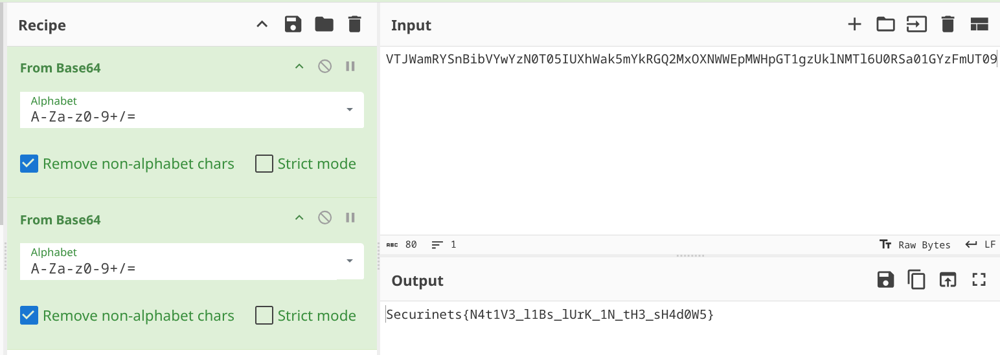

## **Challenge Name :** Native1
### **Category :** Mobile

### **𝐀𝐮𝐭𝐡𝐨𝐫 : [𝐁𝐥𝐚𝐜𝐤𝐤𝐚𝐝𝐞𝐫](https://github.com/Blackkader/)**
---

### **Files Given :** _'Native1.apk'_

---

### Solution

As the task name hints , this challenge is about **Nativelibs** .
On Android, native libraries are basically chunks of code written in C or C++ that your app can carry around. Instead of only writing everything in Java or Kotlin, more ../../Ressources :

* [AndroidDocs](https://developer.android.com/studio/projects/add-native-code)
* [YTvideo](https://www.youtube.com/watch?v=tz15UHfEYVU)
  
Well let's take a look at our **MainActivity** :

```java
public class MainActivity extends AppCompatActivity {
    @Override // androidx.fragment.app.FragmentActivity, androidx.activity.ComponentActivity, androidx.core.app.ComponentActivity, android.app.Activity
    protected void onCreate(Bundle savedInstanceState) {
        super.onCreate(savedInstanceState);
        EdgeToEdge.enable(this);
        setContentView(C0793R.layout.activity_main);
        ViewCompat.setOnApplyWindowInsetsListener(findViewById(C0793R.id.rootLayout), new OnApplyWindowInsetsListener() { // from class: io.securinets.level12.MainActivity$$ExternalSyntheticLambda0
            /* JADX DEBUG: Don't trust debug lines info. Lines numbers was adjusted: min line is 0 */
            @Override // androidx.core.view.OnApplyWindowInsetsListener
            public final WindowInsetsCompat onApplyWindowInsets(View view, WindowInsetsCompat windowInsetsCompat) {
                return MainActivity.lambda$onCreate$0(view, windowInsetsCompat);
            }
        });
        new nativeflag();
    }
```
Ohh it's instanciating a **nativeflag** class , let's take a look at it :
```java
public class nativeflag {
    public native String getFlag();

    static {
        System.loadLibrary("staticflag");
    }
}
```
Oh it has a method called **getFlag** , and it's a native method , so we have to find a way to call it or find its code, and for that we can use frida yet again or we simply extract the .so file and decompile it , we'll go with the second approach , well the library is called **staticflag.so** we can guess that the flag is static there , so i took my guess  and used strings on the .so file and here is the result:

```
Android
r27d
13750724
__cxa_finalize
__cxa_atexit
Java_io_securinets_level12_nativeflag_getFlag
libc.so
LIBC
libdl.so
VTJWamRYSnBibVYwYzN0T05IUXhWak5mYkRGQ2MxOXNWWEpMWHpGT1gzUklNMTl6U0RSa01GYzFmUT09
Android (13691557, +pgo, +bolt, +lto, +mlgo, based on r522817d) clang version 18.0.4 (https://android.googlesource.com/toolchain/llvm-project d8003a456d14a3deb8054cdaa529ffbf02d9b262)
Linker: LLD 18.0.4
.note.android.ident
.dynsym
.gnu.version
.gnu.version_r
.gnu.hash
.hash
.dynstr
.rel.dyn
.rel.plt
.rodata
.eh_frame_hdr
.eh_frame
.text
.plt
.data.rel.ro
.fini_array
.dynamic
.got.plt
.relro_padding
.comment
.shstrtab

```
You saw that ? THATT :
```
VTJWamRYSnBibVYwYzN0T05IUXhWak5mYkRGQ2MxOXNWWEpMWHpGT1gzUklNMTl6U0RSa01GYzFmUT09
```
Looks like a base64 encoded flag , let's decode it(turned out double b64 xd) :




```
Securinets{N4t1V3_l1Bs_lUrK_1N_tH3_sH4d0W5}
```
---