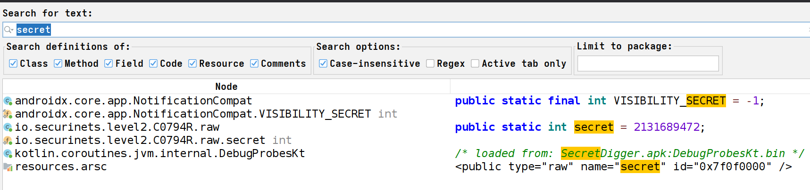
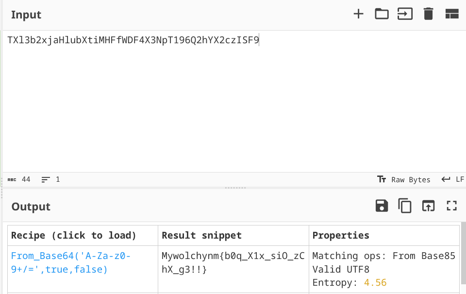
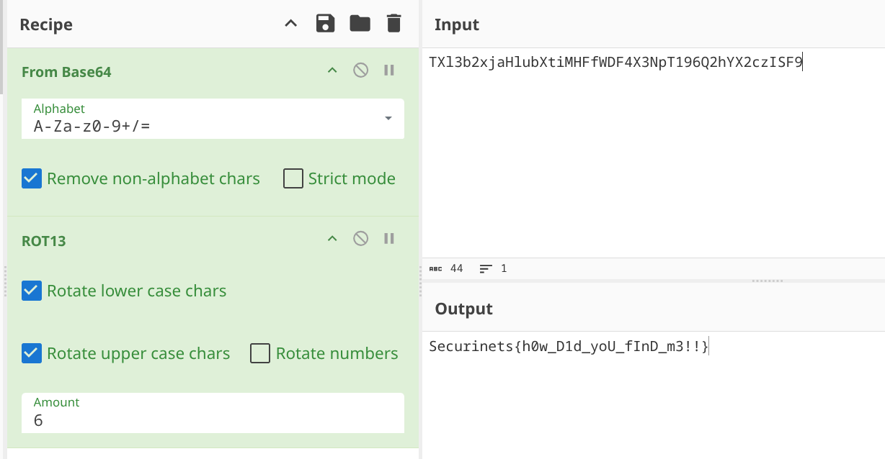

## **Challenge Name :** SecretDigger
### **Category :** Mobile

### **𝐀𝐮𝐭𝐡𝐨𝐫 : [𝐁𝐥𝐚𝐜𝐤𝐤𝐚𝐝𝐞𝐫](https://github.com/Blackkader/)**
---

### **Files Given :** _'SecretDigger.apk'_

---

### Solution

Again , it is asking for creds , so we directly head for **jadx** and we find our check :


```java
public void onClick(View v) {
                String user = username.getText().toString();
                String pass = password.getText().toString();
                if (user.equals("od5el") && pass.equals("thiseasy??")) {
                    Toast.makeText(MainActivity.this, "Login successful?? NOPEEE!!!", 0).show();
                    

```
Hmmm something fishy here , it says **"Login successful?? NOPEEE!!!"** , so we try our creds **(od5el / thiseasy??)** and see what happens : 


Yeah we saw that coming , and this makes sense from the challenge name .. , let's search in our ../../Ressources for the author's **secret**?? using jadx :



Oh , so the author hid the secret in the raw ../../Ressources hehh , we head there and grab the **secret** :
```
TXl3b2xjaHlubXtiMHFfWDF4X3NpT196Q2hYX2czISF9
```
We can guess this is the encrypted flag , and we can also guess its base64 encoded , let's just throw this in [CyberChef](https://gchq.github.io/CyberChef/) and see what we get using **magic** :



Yess it's base64 , but we got : 
```
Mywolchynm{b0q_X1x_siO_zChX_g3!!}
```

And flag format is **Securinets** , hmm  S becomes M and e becomes y , that's rot6 !! we again use cyberchef's rot6 :


And we get our flag :
```
Securinets{h0w_D1d_yoU_fInD_m3!!}
```
---