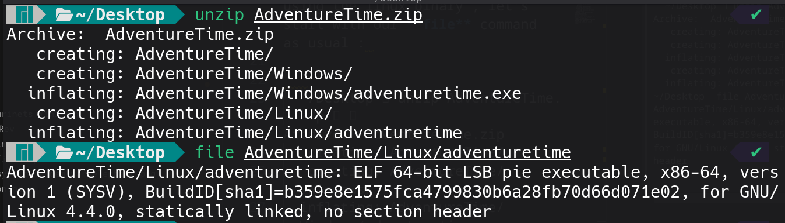
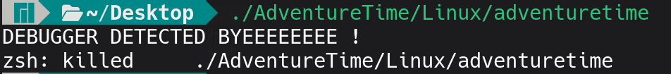
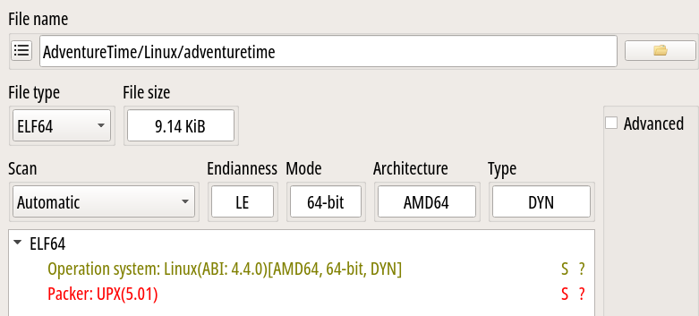
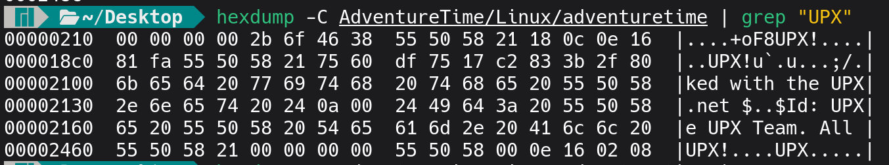
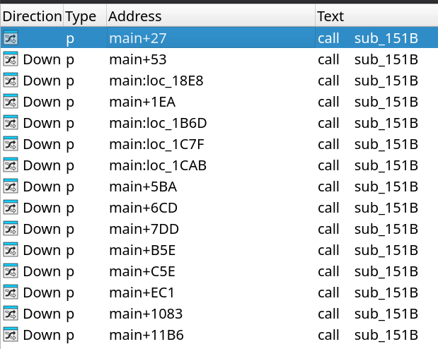

**Challenge Name :** hoogments

### **Category :** Reverse Engineering

### **Description :**

> you know what time it is ! at some point in our childhood, we all wanted these elephants! And here I am, giving them away for free! Use them to get your flag. also i can provide you with your name : "FINN" ( this challenge is for fun )
> 
> 𝐀𝐮𝐭𝐡𝐨𝐫 : 𝐁𝐥𝐚𝐜𝐤𝐤𝐚𝐝𝐞𝐫

### **Files Given :** _'AdventureTime.zip / ancient_psychic_tandem_war_elephant.png'_

---

### Solution


Oh it's adventure time , should be a fun challenge ( that's what the description is saying anyways )

When we extract the zip , we get one binary for linux and an executable for windows , i am currently on linux so i will be using the linux binary , let's start with our **file** command as usual : 



Let's try running it :



hmm interesting , next is our disassembly of course , but when you throw it into **ida** you will notice that it is packed ! , we can verify by using the tool **detect it easy** or known as **die** : 



It's upx ( yet again ) , we try to unpack it using **upx -d** and look what happens :
```python
Linux/adventuretime 
                       Ultimate Packer for eXecutables
                          Copyright (C) 1996 - 2025
UPX 5.0.1       Markus Oberhumer, Laszlo Molnar & John Reiser    May 6th 2025

        File size         Ratio      Format      Name
   --------------------   ------   -----------   -----------
upx: AdventureTime/Linux/adventuretime: NotPackedException: not packed by UPX

Unpacked 0 files.
```
But the tool detected upx , the author manipulated something for sure , we can confirm again using the **strings** command : 

```
 strings AdventureTime/Linux/adventuretime | grep UPX                                     ✔ 
+oF8UPX!
UPX!u`
$Info: This file is packed with the UPX executable packer http://upx.sf.net $
$Id: UPX 5.01 Copyright (C) 1996-2025 the UPX Team. All Rights Reserved. $
UPX!
```
If you start to search for upx related stuff on the internet , you will stumble across this very useful [article](https://www.akamai.com/blog/security/upx-packed-headaches) (you should read it ) , this article provides a [github repository](https://github.com/lcashdol/UPX) that has few tools which can help with those upx headaches as well.

So one of the headaches is **header** **manipulation** , and if you read the article it states that upx headers in binaries most often are **"UPX!"**, we can assume that our headers are corrupted , so let's look for our headers using **hexdump** : 



Ah , we can see that the last **UPX** has no "!" at the end , we can try to change that null byte to a "!" and see what happens , and for that i will be using this [online tool](https://hexed.it/), you can use vim or anything else , and after doing that we try to run our command **(upx -d)** again and we successfully unpack our binary !

```
upx -d AdventureTime/Linux/fixed_adventuretime                                       0|1 ✘ 
                       Ultimate Packer for eXecutables
                          Copyright (C) 1996 - 2025
UPX 5.0.1       Markus Oberhumer, Laszlo Molnar & John Reiser    May 6th 2025

        File size         Ratio      Format      Name
   --------------------   ------   -----------   -----------
     18800 <-      9356   49.77%   linux/amd64   fixed_adventuretime

Unpacked 1 file.
```

Time to throw it in ida and see our main function :


```C
__int64 __fastcall main(const char *a1, char **a2, char **a3)
{
  
  v108 = __readfsqword(0x28u);
  sub_151B(a1, a2, a3);
  if ( (_DWORD)a1 != 2 )
  {
    puts("rly ? can't you provide anything ?");
    a1 = "winnerrrrrrr";
    puts("winnerrrrrrr");
    sub_151B("winnerrrrrrr", a2, v4);
  }
  sub_151B(a1, a2, v3);
  v99[0] = 0;
  .
  .
  .
  v99[27] = 51;
  v77 = 28;
  s = a2[1];
  v78 = strlen(s);
  v89 = malloc(0x1Du);
  if ( !v89 )
  {
    fwrite("Memory allocation failed\n", 1u, 0x19u, stderr);
    sub_151B("Memory allocation failed\n", 1, v5);
  }
  for ( size_4 = 0; size_4 < v77; ++size_4 )
    v89[size_4] = s[size_4 % v78] ^ LOBYTE(v99[size_4]);
  v89[v77] = 0;
  stream = 0;
  v79 = 1;
  file = (char *)sub_16EF(v89);
  if ( stat(file, &buf) || (buf.st_mode & 0xF000) != 0x4000 )
  {
    puts("winner");
LABEL_147:
    if ( stream )
      fclose(stream);
    return v79;
  }
  sub_151B(file, &buf, v6);
  strcpy(v105, "==wZuBnLulXYilmchdzbtxWYulXY5k2chRHbv1Gbh5WehxWamxWY");
  sub_1492(v105);
  v91 = (const char *)sub_1399(v105);
  snprintf(filename, 0x200u, "%s/%s", file, v91);
  stream = fopen(filename, "rb");
  if ( !stream )
  {
    puts("winnerrrr");
    goto LABEL_147;
  }
  sub_151B(filename, "rb", v7);
  if ( !(unsigned int)sub_1670(stream) )
  {
    puts("winnerRRRRRRRRRRRRRRRRRRRRR");
    goto LABEL_147;
  }
  sub_151B(stream, "rb", v8);
  rewind(stream);
  v92 = EVP_MD_CTX_new();
  v93 = EVP_sha256();
  size = 0;
  if ( !v92 || !(unsigned int)EVP_DigestInit_ex(v92, v93, 0) )
    goto LABEL_147;
  while ( 1 )
  {
    v94 = fread(ptr, 1u, 0x1000u, stream);
    if ( !v94 )
      break;
    if ( !(unsigned int)EVP_DigestUpdate(v92, ptr, v94) )
      goto LABEL_147;
  }
  if ( !(unsigned int)EVP_DigestFinal_ex(v92, v101, &size) )
    goto LABEL_147;
  EVP_MD_CTX_free(v92);
  v95 = strlen(s);
  v9 = size;
  v96 = malloc(size);
  for ( i = 0; i < size; ++i )
  {
    v10 = (unsigned __int8)s[i % v95] ^ (unsigned int)(unsigned __int8)v101[i];
    v96[i] = s[i % v95] ^ v101[i];
  }
  sub_151B(v9, v101, v10);
  v11 = size;
  v97 = (char *)sub_17F4(v96, 
  v33 = v81++;
  v34 = (unsigned int)(2 * v56 - 63);
  .
  .
  .
  .
  src[v33] = 2 * v56 - 63;
  sub_151B(v31, "%d", v34);
  src[v81] = 0;
  v85 = v81 - 3;
  memcpy(dest, src, v81 - 3);
  dest[v85] = 0;
  v98[0] = 0;
  v98[1] = -191;
  v98[2] = -131;
  v98[3] = 39;
  v98[4] = 6;
  v98[5] = 45;
  v98[6] = -113;
  v98[7] = -15;
  v98[8] = 4;
  v98[9] = 64;
  v98[10] = -6;
  v98[11] = -67;
  for ( mm = 0; mm < v85; ++mm )
  {
    v35 = (unsigned int)(unsigned __int8)dest[mm] + v98[mm];
    v104[mm] = dest[mm] + LOBYTE(v98[mm]);
  }
  v104[v85] = 0;
  sub_151B(dest, src, v35);
  printf("winnerR : \n ");
  puts(v104);
  return 0;
}
```
that's 400 lines of code , i truncated a lot there .
Anyways , we can check our first function call inside the main which is **sub_151B**

```C
unsigned __int64 sub_151B()
{
  FILE *stream; // [rsp+8h] [rbp-98h]
  char s1[10]; // [rsp+10h] [rbp-90h] BYREF
  char v3[126]; // [rsp+1Ah] [rbp-86h] BYREF
  unsigned __int64 v4; // [rsp+98h] [rbp-8h]

  v4 = __readfsqword(0x28u);
  if ( ptrace(PTRACE_TRACEME, 0, 0, 0) == -1 )
  {
    fwrite("DEBUGGER DETECTED BYEEEEEEEE !\n", 1u, 0x1Fu, stderr);
    raise(9);
  }
  stream = fopen("/proc/self/status", "r");
  if ( stream )
  {
    while ( fgets(s1, 128, stream) )
    {
      if ( !strncmp(s1, "TracerPid:", 0xAu) )
      {
        if ( atoi(v3) > 0 )
        {
          fwrite("DEBUGGER DETECTED BYEEEEEEEE !\n", 1u, 0x1Fu, stderr);
          raise(9);
        }
        break;
      }
    }
    fclose(stream);
  }
  return v4 - __readfsqword(0x28u);
}
```

Oh it's the debugger detector , we can patch the JMP to ignore it but if we see where it was called : 



it's gonna be pain ! so we can just patch the funtion to NOPs !

We procceed now with this : 
```C
if ( (_DWORD)a1 != 2 )
  {
    puts("rly ? can't you provide anything ?");
    a1 = "winnerrrrrrr";
    puts("winnerrrrrrr");
    sub_151B("winnerrrrrrr", a2, v4);
  }
```
We know that **a1** is **argcount** , so the binary is asking for an argument to be provided , the author gave us a png , we can try providing it , but hold on if we read the description he says that he can provide us with our name (our input ??) **FINN**, let's try to dive deeper first , to have a full understanding of the main function 
```C
file = (char *)sub_16EF(v89);
  if ( stat(file, &buf) || (buf.st_mode & 0xF000) != 0x4000 )
  {
    puts("winner");
LABEL_147:
    if ( stream )
      fclose(stream);
    return v79;
  }
```
this part here is checking for file existence thanks to **stat** , if it doesnt the program will exit , let's see what's happening inside **sub_16EF** :

```C
char *__fastcall sub_16EF(const char *a1)
{
  __uid_t v1; // eax
  char *v3; // [rsp+10h] [rbp-10h]
  struct passwd *v4; // [rsp+18h] [rbp-8h]

  v3 = getenv("USER");
  if ( v3 )
  {
    snprintf(s, 0x200u, "/tmp/%s/%s", v3, a1);
  }
  else
  {
    v1 = getuid();
    v4 = getpwuid(v1);
    if ( !v4 )
    {
      fwrite("Error getting username\n", 1u, 0x17u, stderr);
      exit(1);
    }
    snprintf(s, 0x200u, "/tmp/%s/%s", v4->pw_name, a1);
  }
  return s;
}
```
To summarize this function returns this string :
**/tmp/<your_username>/a1's value**

So what we need is the value passed to 
**sub_16EF** which is **v89** in our case , to retrieve that , we can set a breakpoint and get the value (or reverse the xoring operation that has happened earlier in the main function), and **v89** turns out to be : **FL1TZ{woho_you_ARE_ThE_GOAT}**

FINALLY OUR FLAG ! ( they all submitted the fake flag :( )
So the string is actually :
**/tmp/<your_username>/FL1TZ{woho_you_ARE_ThE_GOAT}**

We return to our main and see this :
```C
strcpy(v85, "==wZuBnLulXYilmchdzbtxWYulXY5k2chRHbv1Gbh5WehxWamxWY");
  sub_1492(v85);
  v71 = (const char *)sub_1399(v85);
  snprintf(filename, 0x200u, "%s/%s", file, v71);
  stream = fopen(filename, "rb");
  if ( !stream )
  {
    puts("winnerrrr");
    goto LABEL_147;
  }

```
That's a reversed b64 string , and the function **sub_1492** reverses the string , and **sub_1399** decodes it , so what we get after those two functions is this string :
**alfilaynalmoltasi9aynalmo7aribayn.png**
we can guess that the png the author provided should be named to this , and we know that it should be  put in the path that we just extracted earlier , so our final result will be this :

**/tmp/<your_username>/FL1TZ{woho_you_ARE_ThE_GOAT}/alfilaynalmoltasi9aynalmo7aribayn.png**

He used a fake flag as a directory damn it , now he must be having a final check to confirm that the png is the exact same as the one he provided ( and the rest of the main is just flag manipulation ) , and yep our guess is correct : 
```C
 if ( !sub_1670(stream) )
  {
    puts("winnerRRRRRRRRRRRRRRRRRRRRR");
    goto LABEL_147;
  }


  _BOOL8 __fastcall sub_1670(FILE *a1)
{
  _BYTE ptr[8]; // [rsp+10h] [rbp-10h] BYREF
  unsigned __int64 v3; // [rsp+18h] [rbp-8h]

  v3 = __readfsqword(0x28u);
  return fread(ptr, 1u, 8u, a1) == 8 && !memcmp(ptr, &unk_3047, 8u);
}
```
So to solve this flag (FINALLY) , you just have to put the png in the correct directory and rename it to the name we just found , and provide **FINN** as an argument to the binary , and you will get the flag (yes , no solver needed ) !

```
FL1TZ{G0at3d_T1m3S}
```

---