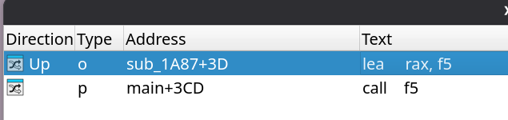
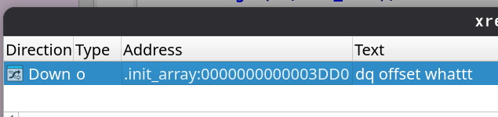

**Challenge Name :** hoogments

### **Category :** Reverse Engineering

### **Description :**

> i can tell that you are going to follow the wrong path ( i see the future ) 
> 
> 𝐀𝐮𝐭𝐡𝐨𝐫 : 𝐁𝐥𝐚𝐜𝐤𝐤𝐚𝐝𝐞𝐫

### **Files Given :** _'hoogments(binary)'_

---

### Solution

We start with our **file** command :

```
hoogments: ELF 64-bit LSB pie executable, x86-64, version 1 (SYSV), dynamically linked, interpreter /lib64/ld-linux-x86-64.so.2, BuildID[sha1]=387955f4ddc2d26288e0f3c43d2b919b0255bd4f, for GNU/Linux 4.4.0, stripped
```

Our usual stripped binary , we try to execute it and give it a random input : 

```
~/All/Rev/summerrush/hoogments  ./hoogments                                                         ✔ 
WELCOMEEE ! can you figure out this one ?
🗥🦳💴⛈🚡❠🚰⛖➰♚🔩😛🪠🍷🛎🍛⛾⚯🥟❀💳🫤🦍❗🩾☩🙏🥹😝🫼😏🧿😥🫏
FL1TZ{testtest}
BYE BYEEEEEEEEEEEEEEEEEEEEEE
:(
```
Oh we got a bye bye , i think giving the correct flag is the way to solve it like usual , let's just throw it in ida and see what we get : 
```C
__int64 __fastcall main(int a1, char **a2, char **a3)
{
  'truncated'

  v23 = __readfsqword(0x28u);
  setlocale(6, locale);
  sub_17A3();
  for ( i = 0; i <= 33; ++i )
  {
    v19[i] = sub_11F9();
    *(_QWORD *)&v19[2 * i + 36] = v3;
  }
  v19[34] = 0;
  wprintf(U"WELCOMEEE ! can you figure out this one ?\n");
  wprintf(U"%ls\n", v19);
  for ( j = 0; j <= 33; ++j )
  {
    v17 = __isoc23_strtol(*(_QWORD *)&v19[2 * j + 36] + 2LL, 0, 16);
    s = (char *)malloc(0x14u);
    sprintf(s, "0x%lx", v17);
    *(_QWORD *)&v19[2 * j + 104] = s;
  }
  for ( k = 0; k <= 33; ++k )
  {
    v14 = __isoc23_strtol(*(_QWORD *)&v19[2 * k + 104], 0, 0);
    v15 = sub_176B(v14);
    v16 = (char *)malloc(0x14u);
    sprintf(v16, "0x%lx", v15);
    *(_QWORD *)&v19[2 * k + 172] = v16;
  }
  for ( m = 0; m <= 33; ++m )
  {
    v11 = __isoc23_strtol(*(_QWORD *)&v19[2 * m + 172], 0, 0);
    v12 = sub_16D0(v11);
    v13 = (char *)malloc(0x14u);
    sprintf(v13, "0x%lx", v12);
    *(_QWORD *)&v19[2 * m + 240] = v13;
  }
  for ( n = 0; n <= 33; ++n )
    v20[n] = __isoc23_strtol(*(_QWORD *)&v19[2 * n + 240], 0, 0);
  if ( fgets(v22, 35, stdin) )
  {
    v22[strcspn(v22, "\n")] = 0;
    for ( ii = 0; ii <= 33; ++ii )
      v21[ii] = v22[ii];
    if ( (unsigned int)sub_17B6(v21, v20) )
      wprintf(U"GRATZZZZZZZ  that should be the flag !!!!!\n");
    else
      wprintf(":");
    return 0;
  }
  else
  {
    wprintf(":");
    return 1;
  }
}
```

We can notice the string **"GRATZZZZZZZ  that should be the flag !!!!!"** , that's our winning message , let's rename variables and functions so it becomes more readable : 
```C
__int64 __fastcall main(int a1, char **a2, char **a3)
{
  v23 = __readfsqword(0x28u);
  setlocale(6, locale);
  f1();
  for ( i = 0; i <= 33; ++i )
  {
    v19[i] = f2();
    *(_QWORD *)&v19[2 * i + 36] = v3;
  }
  v19[34] = 0;
  wprintf(U"WELCOMEEE ! can you figure out this one ?\n");
  wprintf(U"%ls\n", v19);
  for ( j = 0; j <= 33; ++j )
  {
    v17 = __isoc23_strtol(*(_QWORD *)&v19[2 * j + 36] + 2LL, 0, 16);
    s = (char *)malloc(0x14u);
    sprintf(s, "0x%lx", v17);
    *(_QWORD *)&v19[2 * j + 104] = s;
  }
  for ( k = 0; k <= 33; ++k )
  {
    v14 = __isoc23_strtol(*(_QWORD *)&v19[2 * k + 104], 0, 0);
    v15 = f3(v14);
    v16 = (char *)malloc(0x14u);
    sprintf(v16, "0x%lx", v15);
    *(_QWORD *)&v19[2 * k + 172] = v16;
  }
  for ( m = 0; m <= 33; ++m )
  {
    v11 = __isoc23_strtol(*(_QWORD *)&v19[2 * m + 172], 0, 0);
    v12 = f4(v11);
    v13 = (char *)malloc(0x14u);
    sprintf(v13, "0x%lx", v12);
    *(_QWORD *)&v19[2 * m + 240] = v13;
  }
  for ( n = 0; n <= 33; ++n )
    susarray[n] = __isoc23_strtol(*(_QWORD *)&v19[2 * n + 240], 0, 0);
  if ( fgets(Input, 35, stdin) )
  {
    Input[strcspn(Input, "\n")] = 0;
    for ( ii = 0; ii <= 33; ++ii )
      input2[ii] = Input[ii];
    if ( (unsigned int)f5(input2, susarray) )
      wprintf(U"GRATZZZZZZZ  that should be the flag !!!!!\n");
    else
      wprintf(":");
    return 0;
  }
  else
  {
    wprintf(":");
    return 1;
  }
}
```

What concerns us here are the following : 
* The **input**
* The **susarray**
* The **f5**

Now to our surprise , if someone reached this step , and decided to just reverse the f5 , they will cross the wrong path ( like the description stated )
And by reversing f5 we will get the flag : 
```
FAKEFLAG{secret_is_altering_main!}
```
Then you should do your dynamic analysis , let's just put a breakpoint in our f5 function and run , and the surprise is , the f5 isn't even executed !!! HOWW?

The most logical thing to do is , to see where was the **f5** func called , and we can do that by clicking on it then pressing **X**



Oh , i can guess now , that this has to do with **init_array** segment ! **(you can have code there which will be exececuted before main)**
We follow the first reference and here is what we get this function that i will be naming **whattt**: 

```C
__int64 whattt()
{
  sub_12C5(f4, sub_13A7);
  sub_12C5(f3, sub_1A4A);
  sub_12C5(f5, sub_143A);
  return sub_12C5(f1, sub_1758);
}
```
First , to confirm our assumption about the **init_array** segmetn , let's check where **whattt** was referenced using **X** ( yet again ) : 



**BINGOO !!**

This **whattt** is calling a sus function (which i will name it to **magic**) , that is calling the functions we just found in **main** ??? 
```C
unsigned __int64 __fastcall magic(__int64 func1, int func2)
{
  __int64 len; // [rsp+18h] [rbp-28h]
  unsigned __int64 v4; // [rsp+38h] [rbp-8h]

  v4 = __readfsqword(0x28u);
  len = sysconf(30);
  if ( mprotect((void *)(func1 & -len), len, 7) )
  {
    perror("mprotect");
  }
  else
  {
    *(_BYTE *)func1 = -23;
    *(_DWORD *)(func1 + 1) = func2 - func1 - 5;
    if ( mprotect((void *)(func1 & -len), len, 5) )
      perror("mprotect restore");
  }
  return v4 - __readfsqword(0x28u);
}
```
That sounds complicated :/ , or not ?

>This **magic** function is patching memory to redirect execution from **func1** to **func2** . Or in other words **Hooking** !

How is that ?? 
It Writes a JMP Instruction using JMP opcode ! Then calculates the jump offset between the functions !

```C
*(_BYTE *)func1 = -23;  // 0xE9 is the opcode for JMP (since -23 = 0xE9 in 8-bit signed)

*(_DWORD *)(func1 + 1) = func22 - func11 - 5;  // Relative offset to jump from `func1` to `func2`
```
Also even if you look for **mprotect** you will know that it is commonly used in function hooking ! ( because it allows modifying memory permissions dynamically)

Let's rename our functions that were passed to the hooking function : 
```C
__int64 whattt()
{
  magic(f4, realf4);
  magic(f3, realf3);
  magic(f5, realf5);
  return magic(f1, realf1);
}
```
Now what interests is **realf5** cause it will be the one checking the flag! , but as we can see form main , the **susarray** is being manipulated by **realf4**, **realf3** and **realf1** , let's just it's value dynamically by setting a breakpoint before **realf5** is called ! ( or you can reverse the other functions and lose your time :c)
```python
susarray= [32120,32365,32044,2483,32169,2521,32173,2484,2541,2455,32075,32135,32425,31964,32178,31959,2494,2474,32342,2513,32045,32440,32354,2516,32414,2443,32146,32351,32134,32446,32130,32382,32136,32434]
```
Now what's left is reversing the **realf5** function :

```C
__int64 __fastcall realf5(__int64 input, __int64 susarray)
{
  int i; // [rsp+14h] [rbp-2CCh]
  _DWORD v4[36]; // [rsp+20h] [rbp-2C0h]
  _QWORD v5[34]; // [rsp+B0h] [rbp-230h] BYREF
  _QWORD v6[36]; // [rsp+1C0h] [rbp-120h] BYREF

  v6[35] = __readfsqword(0x28u);
  v4[0] = 4;
  v4[1] = 4;
  v4[2] = 6;
  v4[3] = 1;
  v4[4] = 3;
  v4[5] = 1;
  v4[6] = 6;
  v4[7] = 1;
  v4[8] = 1;
  v4[9] = 1;
  v4[10] = 3;
  v4[11] = 4;
  v4[12] = 2;
  v4[13] = 2;
  v4[14] = 5;
  v4[15] = 3;
  v4[16] = 1;
  v4[17] = 1;
  v4[18] = 4;
  v4[19] = 1;
  v4[20] = 3;
  v4[21] = 5;
  v4[22] = 5;
  v4[23] = 1;
  v4[24] = 2;
  v4[25] = 1;
  v4[26] = 6;
  v4[27] = 6;
  v4[28] = 6;
  v4[29] = 3;
  v4[30] = 2;
  v4[31] = 9;
  v4[32] = 9;
  v4[33] = 2;
  qmemcpy(v5, &unk_2140, sizeof(v5));
  qmemcpy(v6, &unk_2260, 0x110u);
  for ( i = 0; i <= 33; ++i )
  {
    if ( v5[i] + 100 * *(_QWORD *)(8LL * i + input) * (int)v4[i] - v6[i] != *(_QWORD *)(8LL * i + susarray) )
    {
      wprintf("B");
      return 0;
    }
  }
  return 1;
}
```
The same goes for **v5** and **v6** , we set our breakpoints and extract their values , and after that we have everthing we need to solve the challenge , here is the python solver : 
```python
susarray=[32120,32365,32044,2483,32169,2521,32173,2484,2541,2455,32075,32135,32425,31964,32178,31959,2494,2474,32342,2513,32045,32440,32354,2516,32414,2443,32146,32351,32134,32446,32130,32382,32136,32434]
v4 =[4, 4, 6, 1, 3, 1, 6, 1, 1, 1, 3, 4, 2, 2, 5, 3, 1, 1, 4, 1, 3, 5, 5, 1, 2, 1, 6, 6, 6, 3, 2, 9, 9, 2]
v6= [0, 0, 0, 8400, 0, 12300, 0, 5100, 10300, 10900, 0, 0, 0, 0, 0, 0, 7200, 4800, 0, 10700, 0, 0, 0, 9500, 0, 7200, 0, 0, 0, 0, 0, 0, 0, 0]
v5= [4120, 1965, 2644, 2483, 5169, 2521, 373, 2484, 2541, 2455, 1775, 935, 9225, 8964, 678, 3459, 2494, 2474, 742, 2513, 7145, 940, 854, 2516, 8614, 2443, 946, 1151, 934, 7246, 8930, 2682, 2436, 7434]
flag=[]
for i in range(34):
    flag.append((susarray[i]+v6[i]-v5[i])/(100*v4[i]))
print("".join(chr(int(x)) for x in flag))

```

```
FL1TZ{53gmeNts?_H0OkS??_wH444Tt!!}
```

---
